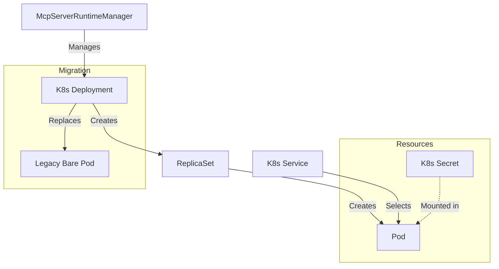

# MCP Server Runtime

The MCP Server Runtime manages the lifecycle of Model Context Protocol (MCP) servers within the Archestra platform. It is responsible for starting, stopping, and monitoring MCP servers, which run as Kubernetes resources when the Kubernetes runtime is enabled.

## Architecture

The runtime deploys each MCP server as a Kubernetes `Deployment`. This ensures high availability and allows Kubernetes to manage the pod lifecycle, including rescheduling during node upgrades or failures.

### Resource Hierarchy

For each MCP server, the following Kubernetes resources are created:

1.  **Deployment**: Manages the pod replicas (currently 1 replica per server).
2.  **Secret**: Stores sensitive environment variables (API keys, etc.).
3.  **Service**: (Optional) Created if the MCP server uses `streamable-http` transport, exposing the server's HTTP port.

### Migration

The runtime includes migration logic to automatically transition legacy "bare Pods" to Deployments. When starting an MCP server, it checks for an existing Pod with the same name. If a legacy Pod is found (one that is not managed by a ReplicaSet/Deployment), it is deleted before the new Deployment is created.

### Diagram



## Key Components

-   `McpServerRuntimeManager`: The main entry point, managing the collection of MCP servers.
-   `K8sDeployment`: Represents a single MCP server deployment, handling the specific K8s API interactions for that server.
-   `schemas.ts`: Zod schemas for runtime status and configuration.

## Configuration

The runtime is configured via the `config` module, which loads settings from environment variables (e.g., `ARCHESTRA_ORCHESTRATOR_KUBECONFIG`).

## Personal MCP Namespace Isolation

MCP servers with `scope: "personal"` can be scheduled into a **separate Kubernetes cluster or namespace** from the main production workload. This prevents personal developer tools from competing with production resources or sharing RBAC/network policies.

### How it works

At startup, `McpServerRuntimeManager` loads **two** sets of K8s clients:

| Client set | Used for |
|---|---|
| Default (`k8sApi`, `k8sAppsApi`, …) | All `scope: "org"` servers |
| Personal (`personalK8sApi`, `personalK8sAppsApi`, …) | All `scope: "personal"` servers |

The helper `getK8sClientsForServer(mcpServer)` routes each operation to the correct client set based on `mcpServer.scope`. Startup sweeps (`backfillRegcredTeamLabels`, `cleanupOrphanedDeployments`) run against **both** namespaces when personal config is configured.

### Fallback behaviour (safe rollout)

If none of the three personal variables below are set, the personal clients fall back to the **default** cluster and namespace automatically. This means the feature is completely opt-in — existing deployments continue to work unchanged.

### Environment variables

| Variable | Description |
|---|---|
| `ARCHESTRA_ORCHESTRATOR_PERSONAL_K8S_NAMESPACE` | Namespace inside the personal cluster (or same cluster) where personal MCP servers are deployed. |
| `ARCHESTRA_ORCHESTRATOR_PERSONAL_KUBECONFIG` | Absolute path to a kubeconfig file pointing at the personal cluster. Leave unset to use the same cluster as the main orchestrator. |
| `ARCHESTRA_ORCHESTRATOR_PERSONAL_LOAD_KUBECONFIG_FROM_CURRENT_CLUSTER` | Set to `"true"` when the personal namespace lives inside the **same** cluster the orchestrator pod runs in (in-cluster auth). Mutually exclusive with `ARCHESTRA_ORCHESTRATOR_PERSONAL_KUBECONFIG`. |

### Example: same cluster, separate namespace

```env
# Existing production config (unchanged)
ARCHESTRA_ORCHESTRATOR_K8S_NAMESPACE=archestra

# New personal config — same cluster, different namespace
ARCHESTRA_ORCHESTRATOR_PERSONAL_K8S_NAMESPACE=archestra-personal
ARCHESTRA_ORCHESTRATOR_PERSONAL_LOAD_KUBECONFIG_FROM_CURRENT_CLUSTER=true
```

### Example: separate cluster via kubeconfig file

```env
# Existing production config (unchanged)
ARCHESTRA_ORCHESTRATOR_K8S_NAMESPACE=archestra
ARCHESTRA_ORCHESTRATOR_KUBECONFIG=/etc/archestra/prod-kubeconfig.yaml

# New personal config — different cluster
ARCHESTRA_ORCHESTRATOR_PERSONAL_K8S_NAMESPACE=personal-mcp
ARCHESTRA_ORCHESTRATOR_PERSONAL_KUBECONFIG=/etc/archestra/personal-kubeconfig.yaml
```

> **Note:** The personal namespace must have the same RBAC grants as the main namespace so that the orchestrator service account can create Deployments, Services, and Secrets there. Grant this via the Helm chart's `orchestrator.kubernetes.rbac.environmentNamespaces` list.

